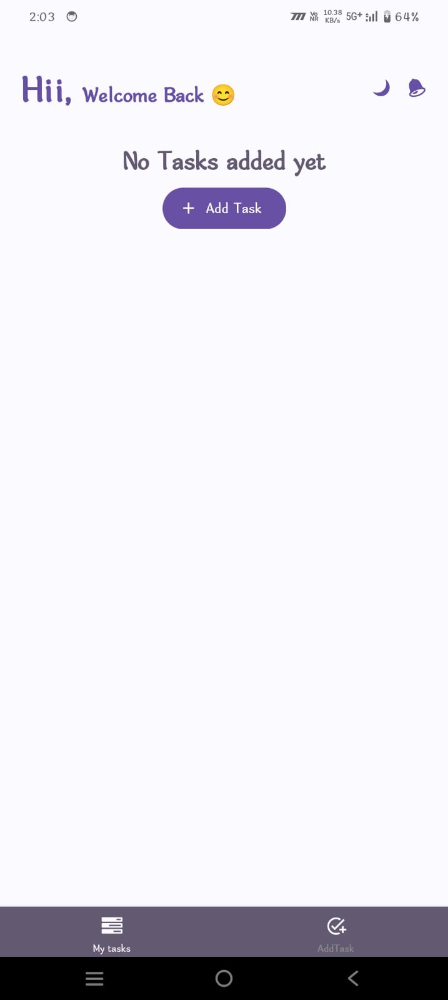
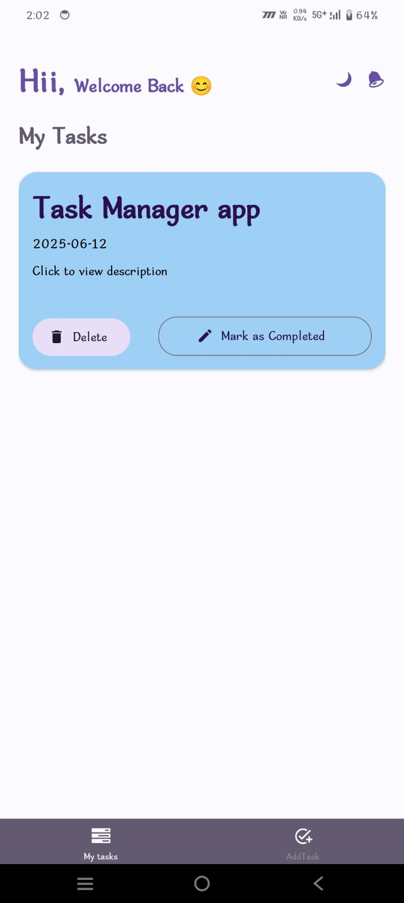
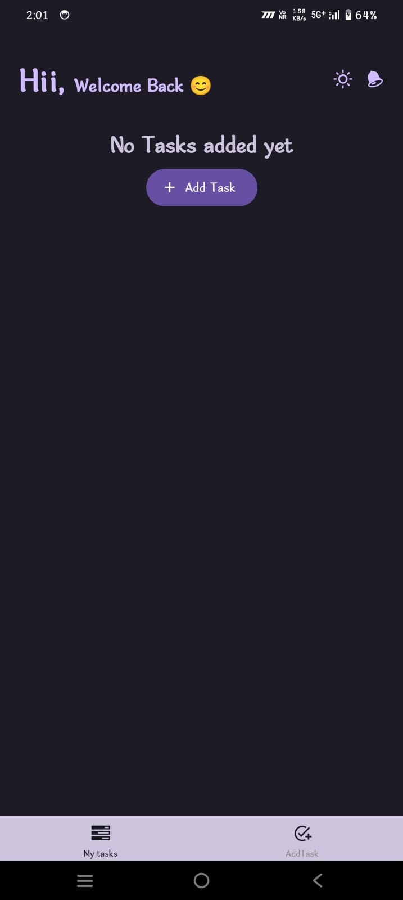
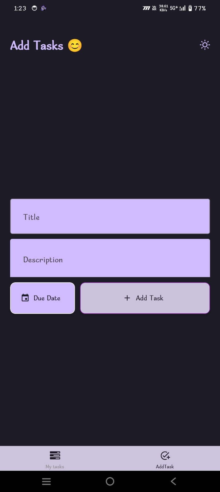
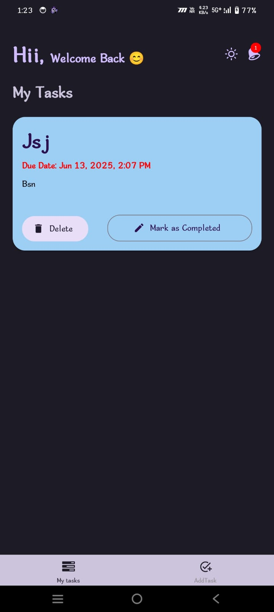

# Task Manager App

A React Native application for managing tasks with a beautiful UI and intuitive features.

## Features

### Task Management
- Create, delete, and mark tasks as complete
- Add task descriptions and due dates
- Beautiful card-based UI with color-coded tasks
- Dark/Light mode support
- Persistent storage using AsyncStorage

### Smart Notifications
- Automatic notifications for tasks due within 24 hours
- Immediate notification when a task is due within 2 hours
- Notification badge showing count of upcoming tasks
- Visual indicators for tasks due soon (red text)
- Notification permission handling

### UI/UX Features
- Clean and modern interface
- Smooth animations and transitions
- Responsive design
- Intuitive navigation
- Task completion status indicators
- Due date formatting with time display

## Screenshots







## Getting Started

### Prerequisites
- Node.js
- React Native development environment
- Android Studio (for Android development)
- Xcode (for iOS development)

### Installation
1. Clone the repository
```bash
git clone [repository-url]
```

2. Install dependencies
```bash
cd TaskManager
npm install
```

3. Run the application
```bash
# For Android
npm run android

# For iOS
npm run ios
```

## Dependencies
- React Native
- React Navigation
- React Native Paper
- @notifee/react-native (for notifications)
- @react-native-async-storage/async-storage
- React Native Vector Icons

## Usage

- **Home Screen**: View all your tasks. If no tasks are added, you'll see a prompt to add one.
- **Add Task Screen**: Create new tasks with a title and description.
- **Task Card**: Click on a task to view its details. Mark tasks as completed or delete them.

## Building the APK

To generate a release APK for Android:

1. **Generate a keystore** (if you haven't already):
   ```bash
   keytool -genkeypair -v -keystore my-release-key.keystore -alias my-key-alias -keyalg RSA -keysize 2048 -validity 10000
   ```

2. **Move the keystore** to `android/app/my-release-key.keystore`.

3. **Configure the keystore** in `android/gradle.properties`:
   ```
   MYAPP_UPLOAD_STORE_FILE=my-release-key.keystore
   MYAPP_UPLOAD_KEY_ALIAS=my-key-alias
   MYAPP_UPLOAD_STORE_PASSWORD=your-store-password
   MYAPP_UPLOAD_KEY_PASSWORD=your-key-password
   ```

4. **Build the APK**:
   ```bash
   cd android
   ./gradlew assembleRelease
   ```

5. **Find the APK** at `android/app/build/outputs/apk/release/app-release.apk`.

## Contributing
Feel free to submit issues and enhancement requests!

## License
This project is licensed under the MIT License.
